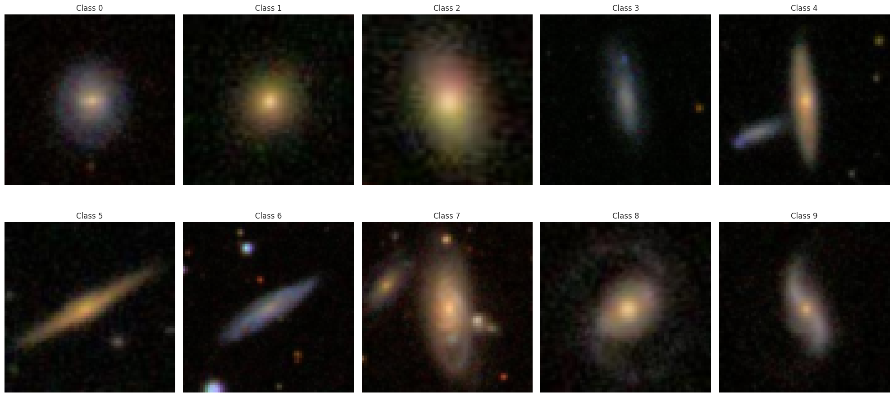

# Classification of galaxies with data from the Sloan Digital Sky Survey and labels from the Galaxy Zoo

## Introduction

The classification of galaxies is an essential aspect for improving the understanding of the universe and its evolution. 

Galaxy10 SDSS is an open dataset for research and educational purposes. It is hosted in Zenodo at the following [link](https://zenodo.org/records/10844811).
It contains 21785 69x69 pixels colored galaxy images in RGB separated in 10 exclusive classes.
The experimental data come from the [Sloan Digital Sky Survey](https://www.sdss.org) and the respective labels from the [Galaxy Zoo](https://www.zooniverse.org/projects/zookeeper/galaxy-zoo/).
Galaxy Zoo is a crowdsourced project which invites people to assist in the morphological classification of large numbers of galaxies. It is an interesting example of citizen science.

## Data description

The original images are 424x424, but were cropped to 207x207 centered at the images and then downscaled 3 times via bilinear interpolation to 69x69 in the data release at the above link. 
The three RGB channels are provided, together with the per-image human-driven classification label.
The dataset contains 21785 images and the population across the various labels is unbalanced. 

The labels are meant to help astronomers analyse galaxy formation and evolution and are as follows:
   * Class 0 (3461 images): Disk, Face-on, No Spiral
   * Class 1 (6997 images): Smooth, Completely round
   * Class 2 (6292 images): Smooth, in-between round
   * Class 3 (394 images): Smooth, Cigar shaped
   * Class 4 (1534 images): Disk, Edge-on, Rounded Bulge
   * Class 5 (17 images): Disk, Edge-on, Boxy Bulge
   * Class 6 (589 images): Disk, Edge-on, No Bulge
   * Class 7 (1121 images): Disk, Face-on, Tight Spiral
   * Class 8 (906 images): Disk, Face-on, Medium Spiral
   * Class 9 (519 images): Disk, Face-on, Loose Spiral

A representation of ten images each corresponding to the ten different labels is given below

## Objectives

1. Build a ten-label classifier able to distinguish the galaxies, and evaluate its performance using the most appropriate evaluation metrics
2. By considering the classifier developed in 1. implement a strategy for inspecting the content of the image for understanding the portions with more discriminant information. In particular, choose one explainability method (e.g., saliency maps, feature map visualization, Grad-CAM, or another interpretable algorithm), and use it to analyze how the model arrived at its decisions
3. Build an algorithm to efficiently perform an anomaly-detection task by considering some of the classes for training and treating the others as unseen.
4. (Optional) Expand upon the algorithm in 3. by considering a perceptual loss as an additionial component to the loss already defined. The perceptual loss does not directly compare two given images in their visual representation but their corresponding feature representations in the latent space of a neural network.

## Expected Deliverables

A Jupiter notebook containing the following:

1.  Data preprocessing steps (possibly with data visualization)
2.  Model(s) architectures
3.  Training and optimization process
4.  Evaluation of results and comparison of different architectures
5.  Visualizations and explanations of your findings

The notebook should be sufficiently documented (code annotation and explanation of the various steps) and should be delivered to the exam committee at least $5$ days before the oral exam.

There is no restriction on the software; you can use PyTorch, TensorFlow, Keras, or whichever you prefer.

## Evaluation Criteria

- Justification of the choices made in model design and optimization
- Correctness and completeness of the code
- Effectiveness of the model (performance metrics)
- Clarity and thoroughness of the Jupyter notebook documentation

